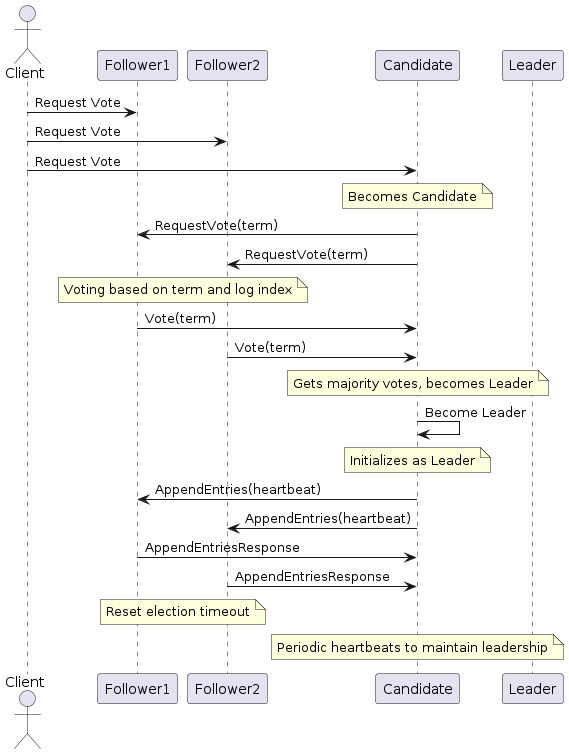
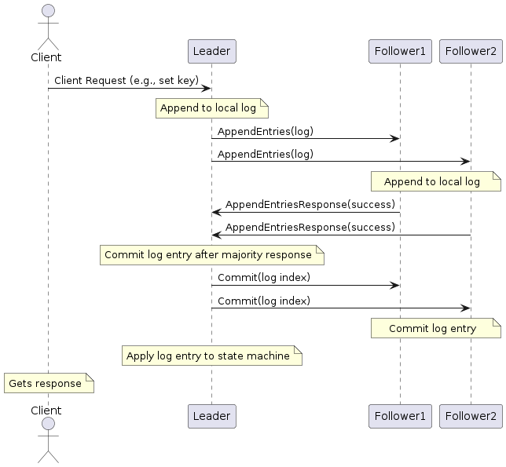

# RaftNode Class Documentation

The `RaftNode` class implements a node in a Raft consensus algorithm-based distributed system. This node can function as a leader, follower, or candidate, coordinating with other nodes to maintain a consistent state.

## General Overview of Election and Log Replication Mechanism
### Election Mechanism

### Log Replication Mechanism

## Initialization

### `__init__(self, kvstore, addr: Address, contact_addr: Address = None)`

Initializes a RaftNode.

- **kvstore**: An instance of `KVStore` for the node's key-value store.
- **addr**: The node's address (instance of `Address`).
- **contact_addr**: Optional address of a contact node to join an existing cluster.

## Private Methods

### `__send_request(self, request: Any, rpc_name: str, addr: Address, retries: int = 3) -> "json"`

Sends an RPC request to another node with retries.

- **request**: The request payload.
- **rpc_name**: The name of the RPC method to call.
- **addr**: The address of the target node.
- **retries**: Number of retries if the request fails.

Returns: Response from the RPC call in JSON format.

### `__broadcast_to_cluster(self, rpc_name: str, request: Any)`

Broadcasts a request to all nodes in the cluster.

- **rpc_name**: The name of the RPC method to call.
- **request**: The request payload.

Returns: Responses from all nodes in the cluster.

### `__initialize_as_leader(self)`

Initializes the node as a leader.

### `__start_heartbeat(self)`

Starts sending heartbeat messages to other nodes.

### `__try_to_apply_membership(self, contact_addr: Address)`

Attempts to join an existing cluster by contacting a known node.

- **contact_addr**: The address of the contact node.

### `__start_watch_timeout(self)`

Starts a thread to watch for election timeouts.

## Public Methods

### `apply_membership(self, json_request: str)`

Handles membership application requests.

- **json_request**: The membership application request in JSON format.

Returns: Response to the membership application in JSON format.

### `notify_leader(self, json_request: str)`

Handles notifications about new leaders.

- **json_request**: The notification request in JSON format.

Returns: Acknowledgment response in JSON format.

### `__start_election(self)`

Starts a new election process.

### `request_vote(self, json_request: str) -> "json"`

Handles vote requests from candidate nodes.

- **json_request**: The vote request in JSON format.

Returns: Response to the vote request in JSON format.

### `heartbeat(self, json_request)`

Handles heartbeat messages from the leader.

- **json_request**: The heartbeat message in JSON format.

Returns: Response to the heartbeat message in JSON format.

### `append_entries(self, json_request: str) -> "json"`

Handles log replication requests from the leader.

- **json_request**: The log replication request in JSON format.

Returns: Response to the log replication request in JSON format.

### `__handle_append_ack(self, log_index: int, follower_addr: Address)`

Handles acknowledgment of log entries from followers.

- **log_index**: The index of the log entry.
- **follower_addr**: The address of the follower.

### `__apply_committed_log(self, log_index: int)`

Applies a committed log entry to the state machine.

- **log_index**: The index of the log entry.

Returns: Result of the command execution.

### `__broadcast_commit(self, log_index: int)`

Broadcasts a commit message to all nodes.

- **log_index**: The index of the committed log entry.

### `commit_entries(self, json_request: str) -> "json"`

Handles commit entries messages from the leader.

- **json_request**: The commit entries request in JSON format.

Returns: Response to the commit entries request in JSON format.

### `execute(self, json_request: str, local_debug: bool = False) -> str`

Executes a command on the leader node.

- **json_request**: The command request in JSON format.
- **local_debug**: Flag for local debugging.

Returns: Response to the command execution in JSON format.

### `__is_all_nodes_committed(self, log_index: int) -> bool`

Checks if all nodes have acknowledged a log entry.

- **log_index**: The index of the log entry.

Returns: Boolean indicating if all nodes have acknowledged.

### `get_leader_address(self)`

Gets the address of the current leader.

Returns: Leader address response in JSON format.

### `get_next_node(self)`

Gets the address of the next node in the cluster.

Returns: Address of the next node.

### `get_leader_address_handler(self)`

Handles requests to get the leader's address.

Returns: Leader address response in JSON format.

### `_execute_local_command(self, command, key, value)`

Executes a command locally for debugging.

- **command**: The command to execute.
- **key**: The key associated with the command.
- **value**: The value associated with the command.

Returns: Response to the local command execution in JSON format.

### `request_log(self, local_debug: bool = False) -> "json"`

Handles requests for the log.

- **local_debug**: Flag for local debugging.

Returns: Log response in JSON format.
